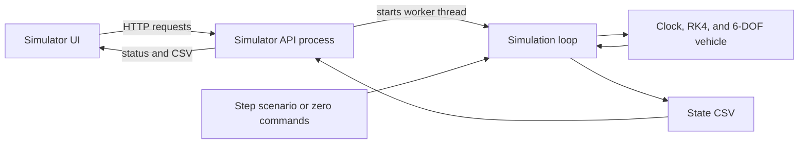
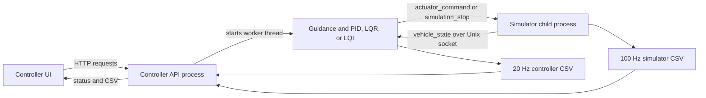

# sub

## Getting started

On a fresh Linux machine, install Python and the virtual-environment support
first:

```bash
sudo apt update
sudo apt install -y python3 python3-venv
```

The startup scripts create `.venv` automatically and install the pinned
packages from `requirements.txt` before launching the services. The first run
can take a few minutes while the virtual environment and scientific Python
dependencies are created. Later runs reuse the environment and are much
faster.

To run the vehicle simulator and its Streamlit UI:

```bash
scripts/start_vehicle_simulator.sh
```

Open the simulator UI at `http://127.0.0.1:8501`. Its local API listens on
port `8765`.

To run the controller and its Streamlit UI:

```bash
scripts/start_controller.sh
```

Open the controller UI at `http://127.0.0.1:8502`. Its local API listens on
port `8766`. Starting the controller does not require the standalone simulator
to be running.

When a mission is submitted, the controller API automatically
starts a dedicated simulator process with its own Unix IPC socket, connects to
it over the repository IPC library, and stops that process when the mission
reaches its goal or time horizon.

The standalone simulator script is only needed when you want to run the
simulator independently, inspect its UI, or drive it from another client.

The scripts support `PYTHON_BIN`, `CONTROLLER_API_PORT`,
`CONTROLLER_UI_PORT`, `SIMULATOR_API_PORT`, and `SIMULATOR_UI_PORT` environment
overrides. Stop the script with Ctrl+C to stop both processes it started.

## Architecture

The simulator owns the clock, RK4 integration, 6-DOF vehicle dynamics, and
state publication. The controller owns waypoint guidance and the PID, LQR,
and LQI control laws. `common/messages.py` defines the shared packet schema,
and `common/ipc.py` provides the Unix socket transport. The controller's
linearization uses the Fossen model in `simulator/scratch/fossen.py`; the
simulator also reuses its ellipsoidal submergence calculation.

### Simulator on its own

`scripts/start_vehicle_simulator.sh` starts the simulator UI and HTTP API as
separate processes. The API runs the simulation loop in a worker thread. A
selected step scenario supplies actuator commands; without a scenario or
external IPC client, the actuators stay at zero. The loop advances the vehicle
model at 100 Hz by default, publishes state to its optional IPC client, and
writes a state CSV. The UI obtains run status and the completed CSV through
the API, then plots the results.



The simulator can also run directly with `python -m simulator`, without the
UI or HTTP API. If no step scenario is selected, an external client may send
actuator commands over its Unix socket.

### Simulator with controller

`scripts/start_controller.sh` starts the controller UI and HTTP API. When a
mission starts, the controller API runs the control loop in a worker thread
and launches a dedicated simulator child process with a unique Unix socket.
The standalone simulator UI and API are not needed for this mode. The
simulator publishes every 100 Hz state and, at each 20 Hz simulated-time
control boundary, waits for a matching actuator command or stop packet.
It integrates five physics steps between boundaries. The controller logs
setpoints, measured state, and commands; the simulator logs every physics
step. The controller API serves both CSV files and run status to its UI.



## Inter-process communication (IPC)

The simulator is the Unix socket server and the controller is its client.
Each controller run creates a separate simulator process and socket. One
full-duplex connection carries state packets from simulator to controller
and actuator commands back to the simulator; the UI uses the local HTTP APIs,
not this socket.

### Why `AF_UNIX` `SOCK_SEQPACKET`?

Both programs run on the same machine, so a Unix domain socket needs no
network port or broker. `SOCK_SEQPACKET` preserves packet boundaries and
delivers successfully sent packets reliably and in order while connected.
Each UTF-8 JSON object is one packet, with no delimiter or length-prefix
parser. Python's standard `socket` module provides the transport. In standalone
mode, nonblocking I/O lets the simulator keep integrating if a client is slow.
The socket is local to one host; use a network transport if the programs must
run on different machines.

| Alternative | Trade-off for this local control loop |
| --- | --- |
| Unix `SOCK_STREAM` | Reliable, but needs explicit message framing. |
| TCP | Supports remote hosts, but adds networking setup that this deployment does not need. |
| UDP | Preserves datagrams, but needs application-level handling for loss and reordering. |
| Shared memory or named pipes | Requires more synchronization or separate handling of the two directions. |
| ZeroMQ, gRPC, or ROS 2/DDS | Adds dependencies or infrastructure for this single local connection. |

### Version 1 message schema

Packets are UTF-8 JSON objects with a `type` and `version: 1`. The maximum
encoded packet size is 64 KiB. Numeric values must be finite; `timestamp_ns`
and `valid_until_ns` use a monotonic clock on the same host, while
`simulation_time_s` is simulated time. Sequence numbers are nonnegative.
The timestamps in the examples below illustrate the schema; live commands
must use the current monotonic time and a future `valid_until_ns`.

The simulator sends `vehicle_state` packets. This example is the initial
state, at rest with its centre of gravity at the waterline:

```json
{
  "type": "vehicle_state",
  "version": 1,
  "sequence": 0,
  "timestamp_ns": 123456789000,
  "simulation_time_s": 0.0,
  "position": {"north_m": 0.0, "east_m": 0.0, "down_m": 0.0},
  "geodetic": {"latitude_deg": 12.9716, "longitude_deg": 80.2209},
  "orientation": {"roll_rad": 0.0, "pitch_rad": 0.0, "yaw_rad": 0.0},
  "velocity_body": {"u_mps": 0.0, "v_mps": 0.0, "w_mps": 0.0},
  "angular_velocity_body": {"p_radps": 0.0, "q_radps": 0.0, "r_radps": 0.0},
  "depth_m": 0.0
}
```

`sequence` counts physics steps. Position and depth are metres in the
North-East-Down frame; `depth_m` equals `position.down_m`. Latitude and
longitude are decimal degrees, orientation angles are radians, body linear
velocities are m/s, and angular rates are rad/s.

The controller replies with an `actuator_command`. Its `sequence` counts
commands; `state_sequence` identifies the state being answered and is required
in synchronized mode but optional for a standalone simulator client:

```json
{
  "type": "actuator_command",
  "version": 1,
  "sequence": 0,
  "timestamp_ns": 123456789500,
  "valid_until_ns": 128456789500,
  "state_sequence": 0,
  "actuators": {"propeller_rpm": 1800.0, "elevator_deg": 0.0, "rudder_deg": 0.0}
}
```

RPM must be 0–3000 and each fin angle must be within ±20 degrees. The
controller service gives each command a 5-second validity window. To end a
synchronized run at a control boundary, the controller sends:

```json
{"type": "simulation_stop", "version": 1, "state_sequence": 0}
```

The exact constructors and validators are in `common/messages.py`; transport
encoding and socket handling are in `common/ipc.py`.

### Missing traffic and failure handling

- In standalone simulator mode, state publication is best effort. A full
  nonblocking send buffer causes that state packet to be counted as dropped;
  the controller's receive helper drains queued states and returns the newest.
  There is no application-level retransmission.
- In standalone mode, the simulator accepts the newest valid command and
  holds it until `valid_until_ns`. With no command, or after expiry, it applies
  zero RPM and zero fin deflections. Malformed, oversized or truncated packets,
  invalid values, expired commands, and duplicate or older command sequences
  are rejected without replacing the last valid command. Gaps in command
  sequence numbers are allowed: a newer valid command takes over. Command
  polling is limited to 64 packets per physics step.
- In synchronized controller runs, the simulator publishes each physics state
  and waits at each 20 Hz control boundary (every five 100 Hz physics steps)
  for a command or stop packet referencing that boundary's state sequence.
  It does not advance past the boundary without one. A missing command or
  undelivered boundary state times out; the controller also fails on a missing
  or out-of-order boundary state. The default controller timeout is 10 seconds.
- Disconnects are detected. The standalone simulator can accept a new
  controller connection; a synchronized run fails rather than continuing
  without its controller.

Tests live in `tests/`. In particular, `test_ipc.py`,
`test_simulator_ipc.py`, and `test_controller_service.py` cover packet
boundaries, validation, expiry, backpressure, disconnects, and synchronized
control behavior.

## Controller

The controller is a waypoint-following autopilot for a torpedo-shaped autonomous
underwater vehicle (AUV). It drives the vehicle toward a target
latitude/longitude while maintaining a requested depth and forward speed.

It controls three actuators:

| Objective | Feedback | Controlled actuator |
|---|---|---|
| Forward speed | Surge velocity and acceleration | Propeller RPM |
| Depth and pitch | Depth, depth rate, pitch, pitch rate | Elevator |
| Heading toward waypoint | Position, yaw, yaw rate | Rudder |

  ### Controller - How it works

  1. Waypoint guidance

     The target latitude/longitude is converted into local north/east coordinates. Each cycle, the controller calculates:
      - Remaining north and east distance
      - Horizontal distance to the waypoint
      - Desired heading using atan2(east_error, north_error)

  2. Depth control

     This is a cascaded controller:

     depth error → desired pitch → elevator command

     The depth PID converts the difference between requested and actual depth into a pitch setpoint. The pitch PID then uses pitch error and
     pitch rate to command the elevator.

  3. Heading control

     The desired heading is compared with the current yaw. The error is wrapped into [-π, π], ensuring the vehicle takes the shortest turn. A
     PID controller then converts this error and yaw rate into a rudder command.

  4. Speed control

     The speed controller combines two terms:
      - Feed-forward RPM calculated from the shared Fossen model’s expected drag at the requested speed
      - PID correction based on surge-speed error and acceleration

     The feed-forward term provides approximately the thrust required to maintain speed, while the PID handles disturbances and transient
     errors.

# References

https://www.fossen.biz/html/marineCraftModel.html - Used it to understand fossen model better
https://man7.org/linux/man-pages/man7/unix.7.html - UNIX manpages for SOCK_SEQPACKET
https://docs.python.org/3/library/socket.html - SOCK_SEQPACKET in python
https://github.com/cybergalactic/FossenHandbook - The full fossen textbook slides
https://github.com/cybergalactic/MSS - Used to scout for reasonable parameters
