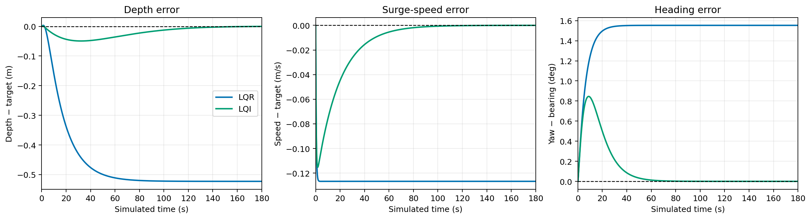
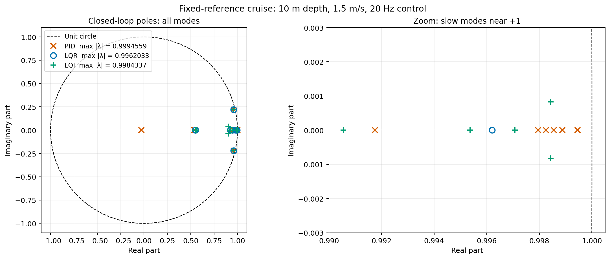
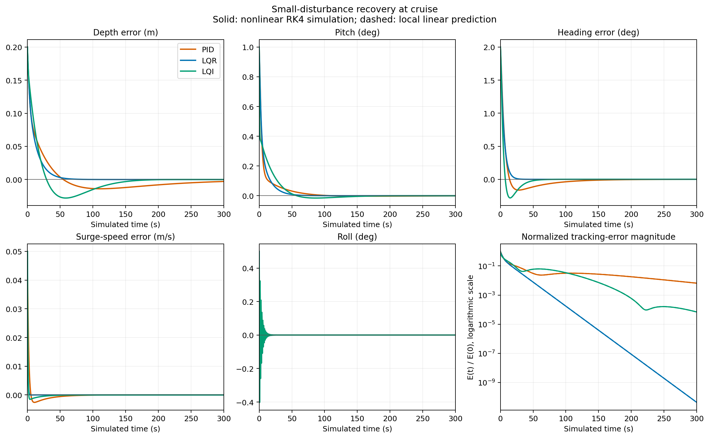
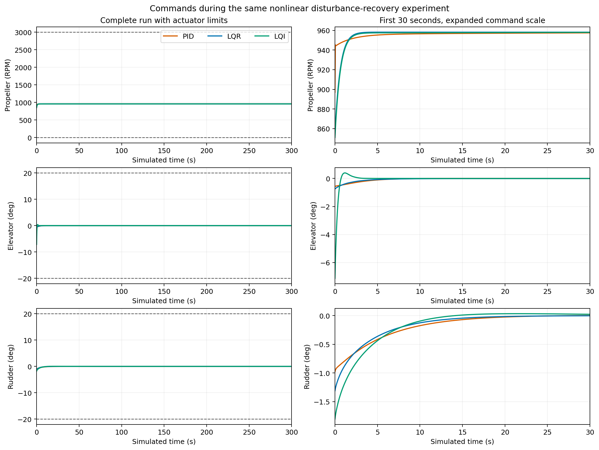
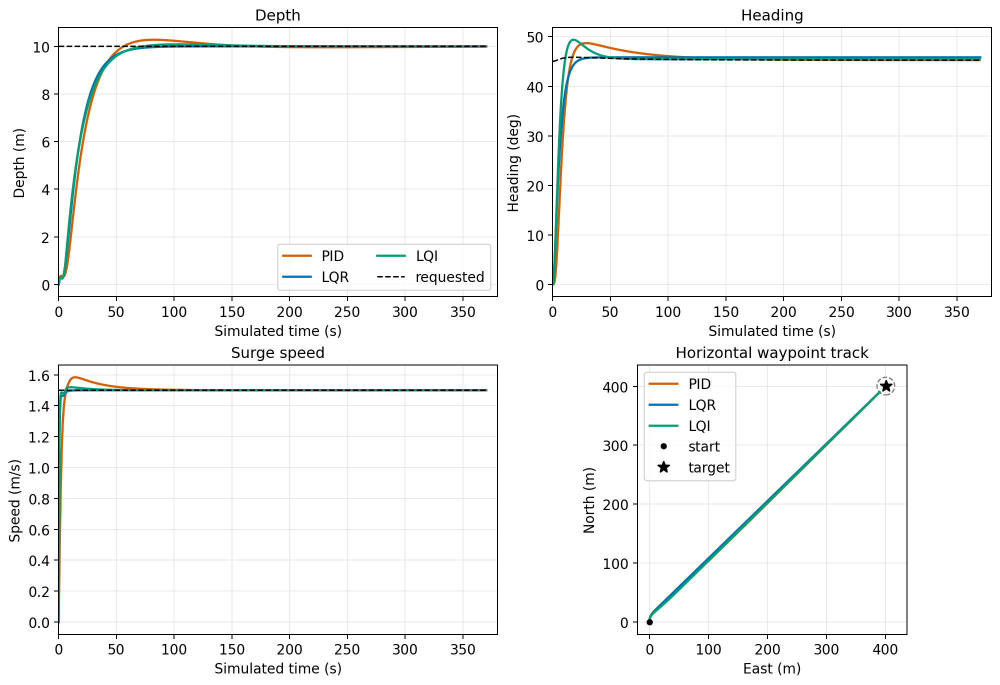
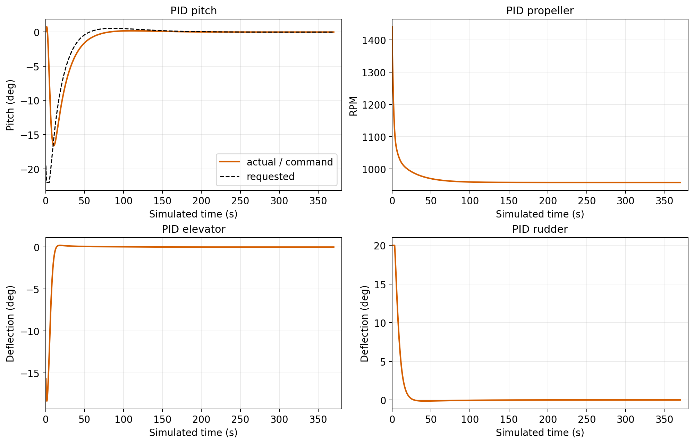

# AUV waypoint controller

## Purpose and data flow

The controller is a separate process that guides the six-degree-of-freedom
simulator toward a latitude/longitude waypoint while tracking depth and
forward (surge) speed. The simulator owns the vehicle dynamics, clock, and
state; the controller owns waypoint guidance and the selectable PID, LQR, or
LQI law. The controller UI talks to its local HTTP API, not to the simulator.
When a mission starts, the API launches one dedicated simulator child process
with a unique Unix socket. It accepts only one active mission at a time.

| Component | Responsibility |
| --- | --- |
| `mission.py`, `guidance.py` | Validate mission input; convert latitude/longitude to local north/east; update target bearing and range. |
| `pid.py`, `lqr.py`, `lqi.py` | Map telemetry and setpoints to RPM, elevator, and rudder commands. |
| `linearization.py` | Numerically linearize the simulator-owned Fossen derivative at cruise for LQR/LQI. |
| `controller.py`, `ipc.py` | Own the simulator process, 20 Hz synchronized loop, IPC connection, stop conditions, and failure handling. |
| `http_api.py`, `../ui/controller_app.py` | Run-control API and separate Streamlit UI. |
| `logger.py`, `visualizer.py` | Control-boundary CSV and post-run plots. |

The simulator owns the Fossen model in `simulator/scratch/fossen.py`, including
its ellipsoidal submergence calculation. LQR/LQI call that model's derivative
for linearization; the controller does not maintain a second vehicle model.
The root [architecture](../README.md#architecture) and
[IPC section](../README.md#inter-process-communication-ipc) describe the
process boundaries, packet fields, sequence numbers, and timeouts.

## Mission and timing

The default mission starts at 12.9716° N, 80.2209° E, level and motionless,
with the vehicle's centre of gravity at the waterline (zero depth). The target
is 12.9752° N, 80.2246° E, about 567 m northeast. Desired depth is 10 m,
desired surge speed is 1.5 m/s, and arrival radius is 15 m. Duration defaults
to 450 s of simulated time.

The start coordinate defines the local North-East-Down origin. For these
short missions, guidance uses a flat-earth latitude/longitude conversion.
Each control cycle it computes the remaining north/east displacement,
horizontal range, and target heading with `atan2(east_error, north_error)`.
Heading error is wrapped to $[-\pi,\pi)$ so the requested turn is shortest.
Arrival is based on horizontal range alone; depth and speed are tracked but
are **not** additional arrival conditions.

The controller runs at a fixed 20 Hz simulated-time rate. The simulator's
physics and nominal state-publication rate can be selected as 60, 80, or
100 Hz, so each control interval contains three, four, or five RK4 steps.
100 Hz is the default. At sequence 0 and every control boundary, the
simulator waits for a command referencing that state sequence; it does not
advance open-loop if the command is missing. A matching stop packet ends the
run on arrival, manual stop, or the time horizon. Startup, communication,
and child-process failures are reported instead of silently continuing.
Simulated time is accelerated by default, not paced to wall-clock time.

## Control laws

All three modes drive the same actuator vector: propeller RPM, paired
elevator deflection, and paired rudder deflection. RPM is clipped to 0–3000;
each fin command is clipped to ±20°. Depth is positive down in NED. A dive
therefore needs a negative pitch setpoint (nose down) in the PID cascade.
Euler angles are shown in telemetry and plots, while the simulator integrates
attitude internally as a quaternion.

### PID

Four PID loops control depth, pitch, heading, and surge speed. Depth error
produces a pitch setpoint; the pitch loop produces elevator deflection.
Heading error and yaw rate produce rudder deflection. Speed control adds a
PID correction to the RPM that balances the model's estimated steady surge
drag at the requested speed:

```math
\begin{aligned}
I_{k+1} &= \mathrm{clip}(I_k+\Delta t\,e_k, -I_{\max}, I_{\max}), \\
c_k &= \mathrm{clip}(K_p e_k+K_i I_{k+1}-K_d\dot y_k, -c_{\max}, c_{\max}), \\
n_{\mathrm{trim}} &= 60\sqrt{\frac{d_u u^*+d_{u2}(u^*)^2}{k_{\mathrm{prop}}}}.
\end{aligned}
```

The derivative term acts on the measured rate rather than the setpoint,
avoiding a derivative kick when guidance changes the requested heading.
Each integral is clamped; the resulting command is also saturated. The
drag coefficients $d_u$ and $d_{u2}$ and propeller coefficient
$k_{\mathrm{prop}}$ come from the shared vehicle parameters. Angles and
angular rates enter the loops in radians and radians per second; fin
commands are in degrees. Integral limits are in each loop's error-times-time
units. The gains and limits are the implemented demonstration values, not
parameters identified from a physical vehicle:

| Loop | $K_p$ | $K_i$ | $K_d$ | Output limit | Integral limit |
| --- | ---: | ---: | ---: | ---: | ---: |
| Depth → pitch magnitude | 0.040 | 0.00035 | 0.12 | 22° | 10 |
| Pitch → elevator | 45 | 1.0 | 16 | 20° | 3 |
| Heading → rudder | 28 | 0.55 | 18 | 20° | 3 |
| Speed → RPM correction | 320 | 35 | 45 | 1200 RPM | 20 |

### LQR

LQR handles coupling among depth, roll, pitch, heading, BODY velocities,
and angular rates with one state-feedback law. It linearizes the
simulator-owned `AUV.derivative` by central finite differences at level
cruise: the requested depth and surge speed, zero lateral/vertical velocity
and angular rates, zero fin deflection, and steady-drag trim RPM. The default
10 m trim is fully submerged. The continuous local model is discretized
with a zero-order hold at 0.05 s; a discrete Riccati equation gives $K$:

```math
\begin{aligned}
\mathbf e_k &= [d-d^*,\;\phi,\;\theta,\;\mathrm{wrap}(\psi-\psi^*),\;u-u^*,\;v,\;w,\;p,\;q,\;r]^{\mathsf T}, \\
\mathbf e_{k+1} &\simeq \mathbf A_d\mathbf e_k+\mathbf B_d(\mathbf a_k-\mathbf a_{\mathrm{trim}}), \\
\mathbf a_k &= \mathrm{clip}(\mathbf a_{\mathrm{trim}}-\mathbf K\mathbf e_k).
\end{aligned}
```

The diagonal $Q$ weights are the inverse squares of state-error scales:
5 m depth; 10°, 15°, and 30° for roll, pitch, and heading; 0.3, 0.5, and
0.5 m/s for $u$, $v$, and $w$; and 10°/s, 15°/s, and 15°/s for $p$, $q$,
and $r$. The diagonal $R$ weights use 800 RPM and 20° for each fin. These
scales express the relative tracking and actuator-use trade-off. The
closed-loop eigenvalues of the *local, unsaturated, fixed-reference* default
linear model lie inside the unit circle; this is not a global stability
guarantee for a turning vehicle or a surface departure. LQR has no integral
states, so persistent model error or actuator bias can leave a steady
tracking offset.

### LQI and why it was added

The initial LQR implementation was adequate for the nominal mission but did
not force zero steady error under changed drag or biased fins. LQI was added
later, before the surface-buoyancy change, specifically to address those
offsets. It retains the LQR plant model and augments it with accumulated
depth, surge-speed, and wrapped-heading errors:

```math
\mathbf z_{k+1}=\mathbf z_k+\Delta t\,[e_d,\;e_u,\;e_\psi]^{\mathsf T},\qquad
\mathbf a_k=\mathrm{clip}\!\left(\mathbf a_{\mathrm{trim}}-
\mathbf K\begin{bmatrix}\mathbf e_k\\\mathbf z_k\end{bmatrix}\right).
```

The implementation limits the three integrals to ±6 m·s, ±20 m, and ±2π
rad·s and conditionally freezes an increment that would push a saturated
actuator farther into saturation. Relative to LQR, the LQI tuning raises
the depth-error weight by 25× and the pitch-error weight by 100×; its
integral-error scales are 30 m·s, 5 m, and 360°·s. These choices were tuned
for bounded commands and a controlled dive transient, not for a general
optimality or robustness guarantee.

The historical scratch robustness check doubles quadratic surge drag and
adds +2° elevator and +1° rudder bias at the actuator. From a submerged
cruise trim, with a 0.1 s control step for 180 s, the comparative final
tracking errors were:

| Law | Depth error | Surge-speed error | Heading error |
| --- | ---: | ---: | ---: |
| LQR | −0.523 m | −0.127 m/s | +1.553° |
| LQI | −0.0002 m | −0.00001 m/s | approximately 0° |

This is a specific model-mismatch experiment, not the default IPC mission
or a guarantee that LQI is always preferable. Integral action adds state
and tuning complexity and can worsen transients if poorly tuned. The
scratch self-test exercises the biased LQI case and its anti-windup rules.

The error histories below use the operational LQR/LQI laws against the
simulator-owned Fossen model in that same submerged, doubled-drag and
biased-fin experiment. They show the persistent LQR offsets and the LQI
settling response, rather than a surface-start IPC run.



## Stability reasoning and evidence

**PID, LQR, and LQI all pass the local closed-loop pole test at the default
submerged cruise condition.** This section explains the system being tested,
how the controller's memory is included, and how the pole results relate to
the vehicle's response. It supports a local stability conclusion, not a
global guarantee for every mission, parameter choice, or disturbance.

### Operating point and scope

The stability experiment regulates constant depth, speed, and heading:

| Setting | Value used in this analysis |
| --- | --- |
| Vehicle | Current default simulator parameters; still water, fully submerged |
| Reference depth and surge speed | 10 m and 1.5 m/s |
| Reference attitude | Zero roll, pitch, and heading; northward level cruise |
| Other BODY velocities/rates | Zero at equilibrium |
| Equilibrium commands | Approximately 958 RPM; zero elevator and rudder |
| Controller interval | 0.05 s, or 20 Hz; commands held between updates |
| Nonlinear integration | Five 0.01 s RK4 steps per controller interval |
| Controller memory | Zero integral errors; previous speed measurement 1.5 m/s |

North/east position continues changing during cruise. It is therefore
excluded from the regulation state, and waypoint bearing is held fixed at
north. This analysis concerns recovery of depth, attitude, and velocity;
it does not establish convergence of horizontal position to a waypoint.
The [mission results](#run-and-inspect-a-mission) test the moving-bearing,
surface-start task separately.

The ten vehicle errors are the same as in the LQR description above:
depth, roll, pitch, wrapped heading, surge-speed error, sway, heave, and
the three BODY angular rates. Quaternion normalization does not introduce
an extra physical attitude mode into this reduced model. At the operating
point, actuator and integral limits are inactive. The analysis also assumes
the implemented synchronized sample timing without additional actuator lag
or communication delay.

### The criterion: closed-loop pole magnitudes, not eigenvector sizes

For a fixed-reference linearized discrete-time system,

```math
\mathbf z_{k+1}=\mathbf A_{\mathrm{cl}}\mathbf z_k,\qquad
\rho(\mathbf A_{\mathrm{cl}})=\max_i|\lambda_i(\mathbf A_{\mathrm{cl}})|<1.
```

Here $\mathbf z$ includes both the vehicle errors and any controller memory.
The eigenvalues of this complete closed-loop state matrix are its
state-space poles. A mode with multiplier $\lambda$ evolves as
$\lambda^k$; magnitudes below one decay, while magnitudes above one grow.
Complex poles can give decaying oscillations. Poles exactly on the unit
circle do not meet the strict asymptotic-stability criterion. See the
[state-space pole definition and stability criteria](https://www.mathworks.com/help/control/ref/dynamicsystem.pole.html).

The test is on **magnitude**: a pole of −1.2 fails even though −1.2 is less
than 1. Eigenvectors describe modal directions and can be multiplied by
any nonzero scalar, so there is no meaningful “eigenvector less than one”
test. For continuous-time models the corresponding condition is negative
real parts; the discrete-time criterion is the one used here.

The simulator's separate `nu.T @ C @ nu == 0` check verifies that Coriolis
coupling does no work. That is a physical consistency check on the plant;
it does not establish stability after adding feedback and integrators.

### Building the complete model for each controller

| Law | Closed-loop state count | Memory included beyond the ten vehicle errors |
| --- | ---: | --- |
| PID | 15 | Four integrals: depth, pitch, heading, speed; one previous surge-speed measurement |
| LQR | 10 | None |
| LQI | 13 | Three integrals: depth, speed, heading |

**LQR.** The local feedback is $\delta\mathbf a=-K\mathbf e$, so the
closed-loop matrix is $A_d-B_dK$. The same plant linearization,
zero-order-hold discretization, weights, and computed gain as the running
controller are used.

**LQI.** Integral states must be included before testing the poles. With
$H$ selecting depth, speed, and heading errors, the augmented plant is

```math
A_{\mathrm{aug}}=\begin{bmatrix}A_d&0\\\Delta t\,H&I_3\end{bmatrix},\qquad
B_{\mathrm{aug}}=\begin{bmatrix}B_d\\0\end{bmatrix},\qquad
A_{\mathrm{cl}}=A_{\mathrm{aug}}-B_{\mathrm{aug}}K_{\mathrm{aug}}.
```

This follows the implementation's order: compute the command using the
current integral, then update that integral for the next sample. Testing
only the ten vehicle states would omit part of the feedback dynamics.
The Riccati construction and its assumptions are described in
[MIT's LQR notes](https://underactuated.mit.edu/lqr.html); the numerical pole
test checks the resulting gain for this particular model.

**PID.** A cascade of PID loops is also a dynamic feedback system, so its
poles can be tested. Positive gains alone are not a stability argument.
The depth loop requests pitch, the pitch loop drives the elevator, and the
plant couples pitch, heave, and depth. All these effects remain in the
combined model. Each PID command uses the integral **after** that sample's
error accumulation. Speed feedback uses
`(u_current - u_previous) / 0.05` for its derivative term, so the stored
previous speed is an additional state. Pitch/yaw derivatives instead use
measured BODY rates; the depth derivative uses the BODY-to-NED conversion.

The analysis calls the actual PID `command()` and telemetry conversion
with these memory states restored on each evaluation. Let $F(z)$ mean one
complete controller update followed by one held-command plant interval.
The closed-loop matrix is obtained by central differences at cruise:

```math
A_{\mathrm{cl}}[:,j]\simeq
\frac{F(+\epsilon\mathbf e_j)-F(-\epsilon\mathbf e_j)}{2\epsilon}.
```

Here $\mathbf e_j$ is a coordinate basis vector, and zero denotes the
trim-relative augmented state. Each evaluation begins with its own stated
integral/history values. Otherwise, numerical differentiation would mix
different controller histories and give the wrong matrix.

The calculation uses $\epsilon=10^{-5}$ in each coordinate's native units
and checks against $10^{-4}$. As an independent implementation check, it
also builds the Jacobian of the actual controller followed by five
nonlinear RK4 steps. For LQR/LQI, the controller-plus-linear-plant
Jacobian is checked against the explicit matrices above.

### Numerical results and how to read the pole plot

At the stated operating point, the controller-plus-linear-plant results are:

| Law | Largest pole magnitude $\rho$ | Modes with magnitude ≥ 1 | Slowest modal time constant |
| --- | ---: | ---: | ---: |
| PID | 0.9994558602 | 0 | 91.86 s |
| LQR | 0.9962032990 | 0 | 13.14 s |
| LQI | 0.9984336834 | 0 | 31.90 s |

The RK4-based check also places every pole inside the unit circle; each
largest magnitude agrees with the corresponding table entry within
$10^{-6}$. These are numerical results for the current coefficients and
gains, not values prescribed by PID or LQR theory.



The left panel shows all poles against the unit-circle boundary. The right
panel expands the slow modes near +1; some shared modes overlap. The zoom
uses different horizontal and vertical scales, so judge the poles against
the drawn boundary rather than expecting a circular shape in that panel.

A pole near one is expected for a slow mode sampled every 0.05 s. Its
envelope time constant is $\tau=-\Delta t/\ln|\lambda|$, which gives the
last column above. This is **not** a mission arrival time or a measured
settling time: the observed response also depends on which modes the
disturbance excites and how strongly they appear in the measured output.
Likewise, $1-\rho$ is not a gain margin, phase margin, or general robustness
guarantee. Do not rank the controllers' overall performance by $\rho$ alone.

### Nonlinear recovery from the same small disturbance

To connect the poles to observable behavior, each controller starts at
the cruise equilibrium with the same simultaneous perturbation:

| Quantity | Initial deviation from cruise |
| --- | ---: |
| Depth | +0.20 m |
| Roll | +0.5° |
| Pitch | +1.0° |
| Heading | +2.0° |
| Surge speed | +0.05 m/s |
| Other velocities/rates and integral errors | Zero |

The previous speed measurement remains at nominal cruise, so the PID sees
the imposed speed change on its first update. References stay fixed; the
experiment runs for 300 simulated seconds without a waypoint-arrival stop.
It uses the production controllers, telemetry conversion, vehicle
parameters, and RK4 integrator directly in an offline harness. It does not
launch the HTTP/IPC services. The separate service tests exercise IPC and
the full mission lifecycle.



Solid curves are nonlinear simulator responses, including the usual command
and integral limits. Dashed curves are predictions from repeated application
of the corresponding $A_{\mathrm{cl}}$, from the same initial vehicle and
controller state. Their agreement near cruise connects the pole analysis
to the implemented dynamics. Error decay, overshoot, and the longer integral
tails are visible without conflating them with surface departure or changing
waypoint guidance.

The final panel uses a logarithmic vertical axis to expose small residuals.
For that panel only, the five displayed errors are divided by their initial
perturbation magnitudes; their Euclidean norm is divided by its initial value
$\sqrt{5}$. This produces a dimensionless comparison starting at one. It is
not a Lyapunov function and need not decrease at every sample; it also does
not include the unplotted velocities or controller memory. Stability is
assessed using all states in the pole calculation, not just this trace.



The left panels show the whole recovery with 0/3000 RPM and ±20° command
limits. The right panels expand the first 30 seconds and the command scale.
The generator verifies that neither actuator nor integral limits are reached
in this particular experiment. That matters because the linear pole result
assumes inactive constraints. Bounded commands alone would not establish
that tracking errors decay.

### What is established, and what still needs separate validation

- **Established numerically:** the complete local models for all three laws
  are asymptotically stable at nominal submerged cruise; the sampled
  nonlinear implementation gives consistent local pole results.
- **Demonstrated in a nonlinear experiment:** small depth, attitude, and
  speed disturbances recover under the implemented controller laws, with
  inactive actuator/integral constraints for the plotted initial condition.
- **Separate mission evidence:** the surface-start arrival plots and service
  tests cover a larger excursion with changing bearing. Successful runs are
  useful validation, but do not prove a global region of attraction.
- **Not quantified here:** gain/phase margins, tolerance to arbitrary model
  errors, additional delays, noise, current, or loss of fin authority at low
  speed. Integrator clamps and LQI anti-windup limit problematic behavior;
  they are not themselves proofs of nonlinear stability. Classical loop
  margins would require specified loop openings with the other loops closed;
  see [stability-margin analysis](https://www.mathworks.com/help/control/stability-margins.html).

### Reproduce the analysis and figures

From the repository root, using the existing requirements:

```bash
.venv/bin/python -m scripts.controller_stability
```

The [analysis script](../scripts/controller_stability.py) regenerates the three
`stability_*.png` figures in `controller/figures/`. It prints pole radii,
RK4 cross-checks, modal time constants, final tracking errors, and minimum /
maximum actuator commands. It checks the trim equilibrium, finite-difference
consistency, LQR/LQI matrix agreement, strict pole stability, finite responses,
inactive limits, and final displayed errors below 5% of their initial
magnitudes. These assertions make the figures reproducible checks of the
current code. Generation takes longer than a pole-only calculation because
it also integrates three 300 s nonlinear recoveries at 100 Hz.

## Tuning

These are reproducible **first-pass estimates from the current simulator**,
not a record of the original gain-tuning iterations or values identified
from a real vehicle. Use the fully submerged default cruise point (10 m
depth, $u^*=1.5$ m/s) for an initial design, then judge it on the nonlinear
surface-start mission. At zero speed the simplified fins have no authority:
their force scales with $u^2$, so cruise gains need a separate departure
check.

### Estimate initial gains from the plant

The simulator parameters give 89 kg effective surge mass, 35 kg·m² effective
pitch/yaw inertia, and $D(1.5)=2(1.5)+10(1.5)^2=25.5$ N of surge drag.
Balancing this drag with $T=0.1(n/60)^2$ gives about **958 RPM** of trim.
Finite-differencing `AUV.derivative` at this point, as `linearization.py`
does, gives these local relationships. Here $\delta_e$ and $\delta_r$ are
fin-command changes in degrees and $\delta n$ is an RPM change:

```math
\begin{aligned}
\delta\dot u &\simeq -0.3596\,\delta u+0.000598\,\delta n, \\
\dot\theta &=q,\quad \dot q\simeq-0.4704\,\theta-11.43\,q+0.0368\,\delta_e, \\
\dot\psi &=r,\quad \dot r\simeq-11.43\,r+0.0368\,\delta_r, \\
\dot d &\simeq w-1.5\,\theta.
\end{aligned}
```

For surge, $D'(1.5)=2+2(10)(1.5)=32$ N/(m/s), so the first decay
coefficient is $-32/89=-0.3596$ s⁻¹; the propeller's thrust slope at trim
gives $0.000598$ (m/s²)/RPM after division by 89 kg. At 1.5 m/s, either
fin produces about 1.288 N·m per degree about the centre of gravity;
dividing by 35 kg·m² gives $0.0368$ rad/s² per degree. Pitch/yaw damping
gives $400/35=11.43$ s⁻¹, and the submerged buoyancy offset gives the
pitch-restoring coefficient $84(9.8)(0.02)/35=0.4704$ rad/s² per radian.

Surge has a $1/0.3596\approx2.8$ s open-loop time constant. For a
**provisional** 2 s proportional speed response, solve
$(0.3596+0.000598K_{p,u})^{-1}=2$ to get $K_{p,u}\approx235$
RPM/(m/s). Pitch and yaw rates decay much faster than the desired angle
responses, so treating those rates as quasi-steady gives the following
starting points. For the depth estimate only, assume the inner pitch loop
tracks its setpoint and neglect heave $w$:

| Loop | Chosen approximate response time | Initial proportional estimate |
| --- | ---: | ---: |
| Pitch | 6 s | $K_{p,\theta}\approx(11.43/6-0.4704)/0.0368=39$ deg/rad |
| Heading | 12 s | $K_{p,\psi}\approx11.43/(12\cdot0.0368)=26$ deg/rad |
| Depth | 20 s | $K_{p,d}\approx1/(1.5\cdot20)=0.033$ rad/m |

These approximations omit heave, fin saturation, the surface transition,
cross-axis coupling, and 20 Hz sampling. They are close in scale to the
implemented $K_p$ values in the PID table above: 320, 45, 28, and 0.040
for speed, pitch, heading, and depth.

Start with derivative and integral gains at zero to check command signs
and proportional transients. Then choose integral action slower than each
P-loop target using $K_i=K_p/T_i$. Trial $T_i$ values of 10, 40, 50, and
100 s for speed, pitch, heading, and depth give $K_i\approx23.5$, 0.97,
0.52, and 0.00033. Add derivative-on-measurement where overshoot needs
damping, and adjust one gain at a time. The implemented $K_i$ and $K_d$ are
listed in the PID table; the approximate equations alone do not fix them.
Large integral action can accumulate against actuator limits even though
the PID integrals are clamped.

For LQR, use the same finite-difference $A,B$ at the requested cruise point,
discretize at 0.05 s, and choose state-error and actuator-command scales.
The implemented heuristic is $Q_{ii}=1/s_i^2$ and $R_{jj}=1/a_j^2$, with
the specific scales listed above. Smaller $s_i$ penalizes that state error
more; smaller $a_j$ penalizes that actuator more. Solve the discrete Riccati
equation and check the eigenvalues of $A_d-B_dK$ lie inside the unit circle.
This is only a local, unsaturated check. For LQI, add the three error
integrals, begin with weak integral weights (large integral scales), and
strengthen them only until persistent depth, speed, or heading offsets
disappear without unacceptable overshoot or saturation. Keep the integral
clamps and saturation check active.

### Validate each candidate against the simulator

1. At a submerged start, inspect the standalone simulator's `surge_step`,
   `elevator_step`, and `rudder_step` responses. Check command signs, trim
   order of magnitude, and rate/angle time scales. These built-in steps are
   larger than the perturbations used for local linearization, so they are
   nonlinear sanity checks rather than direct estimates of local gains.
2. Edit the relevant gains in `pid.py` or weights in `lqr.py`/`lqi.py`,
   restart `scripts/start_controller.sh`, and run the same default mission
   at 100 Hz from zero depth. The UI/API exposes mission and simulator rate,
   **not** controller gains. Tune pitch response before the outer depth
   loop, then speed and heading; change one parameter group per comparison.
3. Download the controller CSV and inspect rise/settling time, depth and
   heading overshoot, steady error, peak pitch/roll, and time spent at
   0/3000 RPM or ±20° fins. Use the nine-panel plot to relate actuator
   saturation to the state transient. If a response is sluggish with spare
   authority, increase the relevant PID $K_p$ or LQR/LQI state weight. If
   it oscillates or rails, reduce aggressiveness or increase the relevant
   LQR/LQI actuator penalty before strengthening integrators.
4. Re-run at 60 and 80 Hz and use the tests in `tests/` as regression gates.
   The surface-start service test expects goal arrival within the 450 s
   horizon, range at most 15 m, final depth error below 0.1 m, surge-speed
   error below 0.05 m/s, wrapped heading error below 1°, and bounded
   commands. For LQI, also run the scratch `--self-test` to exercise the
   doubled-drag and fin-bias case. Repeat after changing plant parameters
   or mission speed; the linearization and fin authority change with the
   operating point.

For an open-loop check, use the simulator UI or run this example from the
repository root with a fresh output filename:

```bash
.venv/bin/python -m simulator --scenario elevator_step --initial-depth 10 --frequency 100 --duration 30 --output /tmp/auv-elevator-step.csv
```

For the LQI stress check:

```bash
.venv/bin/python -m controller.scratch.controller --controller lqi --self-test
```

## Run and inspect a mission

From the repository root on Linux, start the controller API and Streamlit UI:

```bash
scripts/start_controller.sh
```

The script creates `.venv` and installs pinned requirements if needed.
Open `http://127.0.0.1:8502`; the API listens on `127.0.0.1:8766`.
The controller UI lets you set start/target coordinates, depth, speed,
arrival radius, controller mode, horizon, and simulator rate. The separate
standalone simulator service does **not** need to be started. The ports can
be changed with `CONTROLLER_UI_PORT` and `CONTROLLER_API_PORT`.

The same run can be submitted over HTTP:

```bash
curl -sS -X POST http://127.0.0.1:8766/api/runs \
  -H 'Content-Type: application/json' \
  -d '{"controller_type":"lqi","simulator_frequency_hz":100,"duration_s":450,"mission":{"start_lat":12.9716,"start_lon":80.2209,"target_lat":12.9752,"target_lon":80.2246,"depth_m":10,"speed_mps":1.5,"arrival_radius_m":15}}'
```

The response contains a `run_id`. Omitted fields use the defaults above.
Useful endpoints are:

| Method and path | Purpose |
| --- | --- |
| `GET /api/config` | Defaults and supported controller/simulator rates. |
| `POST /api/runs` | Start one mission; returns HTTP 202 and a `run_id`. |
| `GET /api/runs/{id}` | Poll status and latest state/command; completion reasons are `goal`, `horizon`, or `stopped`. |
| `POST /api/runs/{id}/stop` | Request a stop at the next control boundary. |
| `GET /api/runs/{id}/csv` | Download controller samples at 20 Hz boundaries. |
| `GET /api/runs/{id}/state-csv` | Download every completed simulator physics step at the selected rate. |

The controller CSV includes time, NED and geographic position, actual and
requested depth/heading/speed/pitch, roll, target range, commands, and BODY
velocities/rates. Once a run completes, the UI renders a labelled nine-panel
figure: requested versus actual depth, heading, speed, and pitch; roll; RPM,
elevator, and rudder; and the north/east trajectory with start and target.
The simulator CSV resolves the intervening physics steps. Download both
before starting another run; only the latest run is retained by the service.

For reference, a default surface-start mission at 100 Hz produced this
sample output in simulated time. These are observed results, not fixed
arrival-time promises:

| Mode | Arrival time | Final depth | Final surge speed | Final target range |
| --- | ---: | ---: | ---: | ---: |
| PID | 369.80 s | 9.9865 m | 1.5000 m/s | 14.9883 m |
| LQR | 370.25 s | 10.0000 m | 1.5000 m/s | 14.9676 m |
| LQI | 369.70 s | 10.0000 m | 1.5000 m/s | 14.9905 m |

The following traces come from separate default missions run through the
controller service and simulator IPC at 100 Hz physics and 20 Hz control.
The black dashed curves are the PID run's requested values; depth and speed
requests are identical across modes, while each mode updates its own heading
request from its current position. The dashed circle is the 15 m arrival
radius, so the tracks end upon entering it rather than at the target point.



The PID run below shows the pitch transient alongside its setpoint and the
three actuator commands. It makes command limits and the surface-departure
transient visible; the UI's nine-panel figure provides the same views for
any selected mode.



Regenerate these figures with `.venv/bin/python -m scripts.generate_readme_plots`
from the repository root. The script also regenerates the simulator figures.

In each case the vehicle departed zero depth, commands stayed within their
limits, and the goal was reached. The repo's `tests/` folder contains the
controller model, service, and UI tests, including surface-start arrival
checks for all three laws at 60, 80, and 100 Hz. Run them with:

```bash
.venv/bin/python -m pytest -q tests/test_controller_models.py tests/test_controller_service.py tests/test_controller_ui.py
```

## Interpretation and limits

The nominal depth/speed traces and trajectory demonstrate waypoint tracking
for this illustrative plant. PID is easy to inspect and tune loop by loop;
LQR couples the vehicle states and actuator penalties but assumes its local
linearization and trim remain representative; LQI can remove persistent
offsets but needs anti-windup and more tuning. All three use the same
saturated actuator model and stop at the same horizontal arrival radius.

The plant coefficients are illustrative rather than measured. The flat-earth
guidance approximation is suitable for the short example, not long routes.
The LQR/LQI gain is recomputed for the requested depth and speed at startup,
but not continuously relinearized as attitude, depth, or speed change. The
default gain is designed around fully submerged level cruise even though the
mission begins at the surface. There is no environmental current, sensor
noise, obstacle avoidance, or real-hardware validation in this demonstration.

## References

- [Fossen, *Marine Craft Model*](https://www.fossen.biz/html/marineCraftModel.html):
  BODY/NED dynamics, added mass, damping, and restoring forces used as the
  model basis. The numerical coefficients and gain estimates above come from
  this repository's simulator, not from Fossen's page.
- [Åström and Murray, *Feedback Systems*, Chapter 10: PID Control](https://www.cds.caltech.edu/~murray/books/AM05/pdf/am08-pid_19Jul11.pdf):
  PID tuning, actuator saturation, and implementation trade-offs.
- [Tedrake, *Underactuated Robotics*: Linear Quadratic Regulators](https://underactuated.mit.edu/lqr.html):
  quadratic state/input costs, feedback gains, and discrete-time LQR.
- [SciPy `cont2discrete`](https://docs.scipy.org/doc/scipy/reference/generated/scipy.signal.cont2discrete.html):
  zero-order-hold discretization used by `linearization.py`.
- [SciPy `solve_discrete_are`](https://docs.scipy.org/doc/scipy/reference/generated/scipy.linalg.solve_discrete_are.html):
  discrete Riccati solver used to compute LQR and LQI gains.
